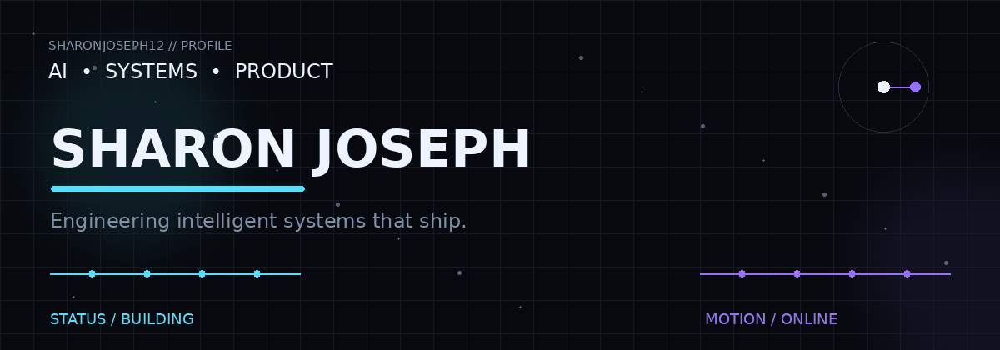

<div align="center">



<a href="https://github.com/sharonjoseph12">
  
</a>

<br />

<a href="https://github.com/sharonjoseph12">
  
</a>
<a href="https://github.com/sharonjoseph12?tab=repositories">
  
</a>
<a href="https://github.com/sharonjoseph12?tab=stars">
  
</a>

</div>

---

## `> whoami`

I'm a developer who likes building **complete systems**, not just demos.

My work sits at the intersection of:

`AI` · `Computer Vision` · `Agentic Systems` · `Full-Stack Engineering` · `Healthcare` · `FinTech` · `Developer Tools`

I care about the part after the prototype: **architecture, reliability, security, observability, and a product people can actually use.**

---

## `> selected work`

<table>
<tr>
<td width="50%" valign="top">

### 👁️ Nayana

**Clinical vision + communication**

A webcam-first clinical platform using gaze interaction, real-time telemetry, caregiver bridging, and assistive communication.

`React` `Vite` `MediaPipe` `WebRTC` `Twilio`

<a href="https://github.com/sharonjoseph12/Nayana_codex">View repository →</a>

</td>
<td width="50%" valign="top">

### 🌪️ VORTEX

**Sovereign escrow + AI verification**

A Web3 bounty protocol combining Algorand escrow, sandboxed execution, adversarial checks, multimodal AI evaluation, and oracle consensus.

`Next.js` `FastAPI` `Docker` `Algorand` `Gemini`

<a href="https://github.com/sharonjoseph12/vortex_reva">View repository →</a>

</td>
</tr>

<tr>
<td width="50%" valign="top">

### 🛡️ Kawach

**AI safety intelligence**

A cross-platform safety ecosystem with multi-modal SOS triggers, offline relay, AI-assisted incident analysis, geospatial intelligence, and evidence integrity.

`Flutter` `Gemini` `Supabase` `PostGIS` `BLE`

<a href="https://github.com/sharonjoseph12/Kawach_new">View repository →</a>

</td>
<td width="50%" valign="top">

### 🧬 PRISM / Vaidya

**Passive health intelligence**

A multimodal health-screening research platform exploring contactless vitals, acoustic signals, risk modelling, and explainable outputs.

`Python` `rPPG` `MediaPipe` `XGBoost` `YAMNet`

<a href="https://github.com/sharonjoseph12/Vaidya">View repository →</a>

</td>
</tr>

<tr>
<td width="50%" valign="top">

### 🧠 Antarix

**Verified skill proof ecosystem**

A multi-portal platform connecting learning signals, verified work, colleges, and hiring.

`Next.js` `TypeScript` `Supabase` `pgvector` `Playwright`

<a href="https://github.com/sharonjoseph12/Anatrix_my">View repository →</a>

</td>
<td width="50%" valign="top">

### 🔬 More experiments

AI prototypes, mobile systems, computer vision work, developer tooling, hackathon builds, and coursework across the rest of the profile.

<a href="https://github.com/sharonjoseph12?tab=repositories">Explore all repositories →</a>

</td>
</tr>
</table>

---

## `> stack`

<p align="center">
  
</p>

<p align="center">
  <sub>AI / ML · Full Stack · Mobile · APIs · Data · Cloud · DevOps</sub>
</p>

---

## `> engineering mindset`

```text
idea
  │
  ├── understand the problem
  ├── model the system
  ├── build the smallest real thing
  ├── test the failure modes
  ├── instrument everything useful
  └── ship → learn → iterate
```

> **Build less theatre. Ship more substance.**

---

## `> github telemetry`

<div align="center">


</div>

<br />

<div align="center">


</div>

---

## `> contribution matrix`

<div align="center">


</div>

---

## `> connect`

<div align="center">

<a href="https://github.com/sharonjoseph12">
  
</a>
<a href="https://www.linkedin.com/in/sharon-joseph-b2742a326">
  
</a>

</div>

<br />

<div align="center">

### `building systems, not just screens.`

<sub>© Sharon Joseph · crafted with Markdown, SVGs, GIFs & GitHub Actions</sub>

</div>
